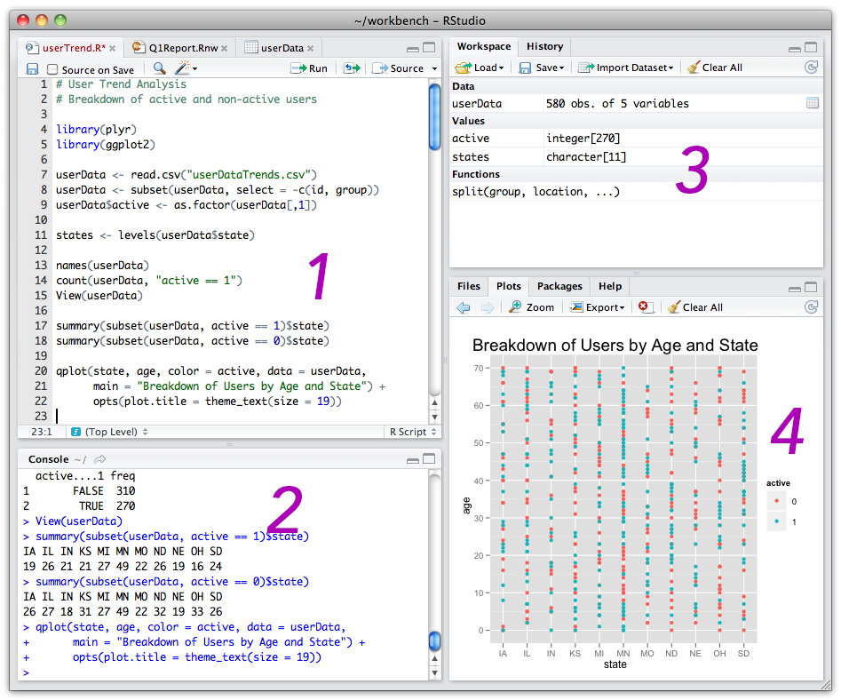
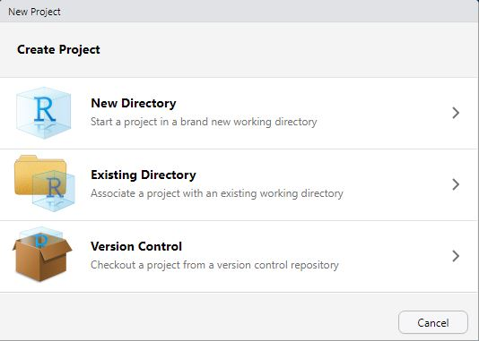
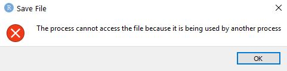
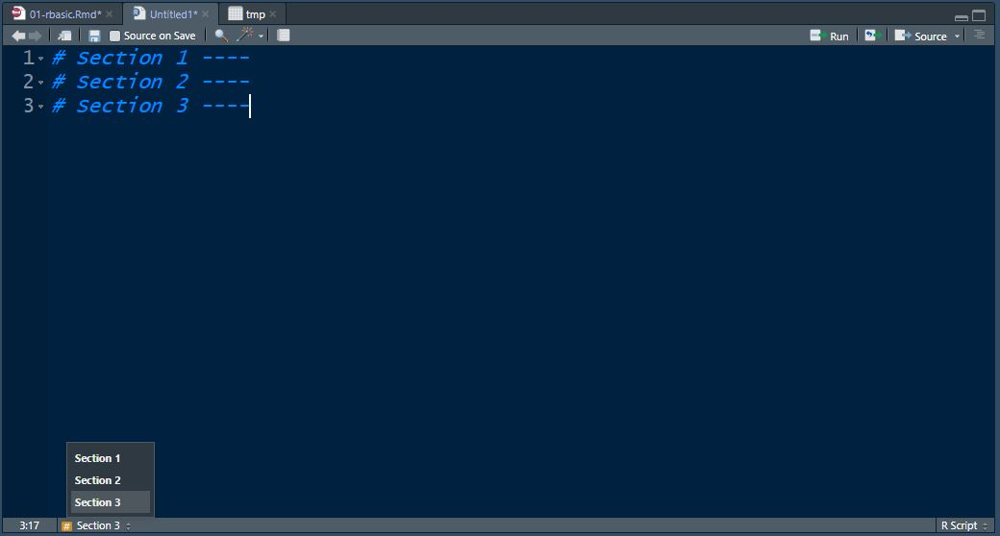

# R Basics

This chapter will introduce you to installing R, becoming familiar with the RStudio environment, installing packages, and loading data.

## Installing R

Your adventure with R begins with downloading and installing the required software, which is free! This will first require you to install **R**, which is the underlying language and software we will be working with. R is available for Windows, Mac OS, and Linux.

**You can download R here: [https://cran.rstudio.com/](https://cran.rstudio.com/).**

* For Windows users, you will want to download R Base. [Here is a direct link with further instructions](https://cran.rstudio.com/bin/windows/base/).

* For Mac users, you will [follow the directions here](https://cran.rstudio.com/bin/macosx/).


## Installing RStudio

Once R is installed, you will download and install **RStudio Desktop**. This is the environment (software program) in which you will work with R. RStudio is also available for Windows, Mac and various versions of Linux..

**You can download RStudio here: [https://rstudio.com/products/rstudio/download/#download](https://rstudio.com/products/rstudio/download/#download).**

## RStudio Features



The RStudio environment is organized into four panes:

1. **Source** - The source is where you will write and execute your code. This is your script or syntax.

2. **Console** - The console displays output, warnings, and more.
      + The console is where you will see the output of your code. For example, if you run a script to calculate a mean in the source, the mean will appear in the console.
      + The console will also show any error messages or warnings. These will appear in red.
      + Any packages that you will install should be written here, not in your script. This is because you will only install a package once. If it is in your script and you run all of your script, it will try to install the packages multiple times.
        + Note: You can also include the install command in your script (at the top) and use a `#` sign to comment it out so that it doesn't run when the script us run. This is useful if you are sharing a script and the other user may need to install the packages or if you may need to install them in the future.
        + Whether you write it in the script or the console is a personal choice.
  
3. **Environment** - The environment is mainly used to show the data frames and other files you have loaded. It will tell you the datafile name, how many rows (*obs.*) and how many columns (*variables*).

1. **Files, Plots, Packages, Help, and Viewer**
      + The Files tab will show local files in your R Project.
      + The Plots tab will show any visualizations you have created.
      + The Packages tab will allow you to see, load, and unload any packages you have installed. You can also install packages through this tab.
        + We will usually install packages using the `install.packages()` function and  load packages using the `library()` function.
      + The Help tab will show explanations and examples of functions.
        + We can ask for help in the console by using `?`. For example, `?mean` will give additional information about the `mean()` function.
      + Viewer is used for any webpages that get produced through your code.


## Setting up RStudio

Once RStudio is installed, I recommend setting it up so that the environment is more comfortable to work in.

One way to do this is to reconfigure the panes so that they are easier to navigate.

At the top of RStudio, click on **Tools > Global Options** and select **Pane Layout**. Change your options to the ones in the image below. This will allow you to read your output right next to your script. You can also easily minimize your environment, as you will not need to look there very often.


Next, you can switch the colors of R to something more comfortable for your eyes. A darker background reduces the amount of light hitting your eyes and can lessen eye strain.

At the top of RStudio, click on **Tools > Global Options**. Select **Apperance** on the left-hand side. Under **RStudio Theme**, you can change the colors. I have my own RStudio Theme as *Modern*. It is a dark-blue background with white text.


Changing your theme to *Modern* and switching your panes as I recommended will make your RStudio look like this:


-----

## R Files

Before working with R, there are several different R filetypes that you should learn about.

### .R - R Scripts

Files that end in .R are your basic R scripts. You can create a single R script for your project, or create one for each phase, i.e., a data cleaning script, a script for RQ1, a script for RQ2, etc.

### .rproj - R Projects

R Projects are very important to utilize. Without creating an R Project, you will need to include a file path to your working directory and run this code every time you start your script.

To set a working directory, you would write the following in your **source** pane, inside the R script. You would then highlight the code or place your cursor somewhere inside the code and click **Run** at the top right of the **Source** pane, or Click *Ctrl+Enter* (or on a Mac, **Cmd+Enter**).

`setwd("C:/path/to/your/directory")`

*Quotes, correct capitalization, and forward slashes are important here.*

If you move your files to a new directory, you will have to rewrite this command or nothing in your script will run.

You can also set a working directory through RStudio by going to **Session > Set Working Directory** and selecting one of the choices. You will have to do this every time you open the R script. 

R Projects avoid all of this. Any file that is in the same folder as the .Rproj file is automatically linked to the R Script. That means you can create a folder with your project, move that folder anywhere or give it to anyone, and when they double-click the .Rproj file, it will work!

Any subdirectories will still need to use a short path name, i.e., `read_csv("subfolder/file.csv")`, but this is much simpler than utilizing the long path name.

To create an R Project, simply go to **File > New Project...**. You will see the following screen:



 * If you want to create a new directory, select **New Directory**. On the next screen, choose **New Project**, locate where you want to put your project, and click **Create Project**
 * If you have a directory already and you just want to make it into a project, click **Existing Directory**
 * The **Version Control** option is useful if you will be placing your project on Github (see section on [Github](#github)).
 
There is a small issue with R Projects if you save them in Dropbox on your local machine. As Dropbox is constantly trying to sync your files to the cloud, it causes some interference with RStudio. You will see this message flash every 10 mins or so. It is nothing serious, just annoying. Click OK (or press the spacebar) and continue working. This [forum post may provide a solution to the problem](https://community.rstudio.com/t/mostly-resolved-dropbox-box-sync-google-drive-etc/6098).



### .RData - R Data Files

As you begin working in R, you will inevitably have a number of dataframes saved to your **Environment** pane. These may be datasources you loaded, dataframes you created, or raw data, cleaned data, analyses, models, etc. While you could simply re-run your script, you can also save everything in your Environment to an R Data file. When you load the R Data file, all of those dataframes will reload. An additional bonus is that these files are smaller due to compression!

This is particularly useful if you are creating the data frames in one script and will use them in another script.

To save your Environment to an R Data file, you have a few options. You can run these in your script or in the console. That's up to you.

#### Save .RDS

This allows you to save a **single** object in the environment:

```
# Save an object to a file
saveRDS(object, file = "my_data.rds")

# Restore the object
readRDS(file = "my_data.rds")
``` 

#### Save .RData

This allows you to save specific objects:

```
# Saving on object in RData format
save(data1, file = "data.RData")

# Save multiple objects
save(data1, data2, file = "data.RData")

# To load the data again
load("data.RData")
```
#### Save your entire workspace

You can save your entire environment:

```
# Save all objects
save.image(file = "my_work_space.RData")

# Load your environment
load("my_work_space.RData")
```

### .RMD - R Markdown

R Markdown combines R and document or webpage authoring in a single file. R Markdown is useful if you want to write code and a report, render that report to a Word file, a PDF, or publish it online at [RPubs](http://www.rpubs.com). However, it is beyond the scope of this handbook. Please see the [free, online R Markdown book, *R Markdown: The Definitive Guide*](https://bookdown.org/yihui/rmarkdown/).

-----

## R Data Structures

A number of different objects can exist in the RStudio environment. Here are a few definitions.

### Vector

Vectors are basically one single column of a data frame. All elements in this dimension must be the same type (e.g. integers, strings, logical elements like TRUE and FALSE).

The following commands create vectors.

```{r}
name <- c("Mike", "Will", "Dustin", "Lucas", "Elle") 
age <- c(20, 25, 30, 35, 40) 
```

**A note on c**

> The `c` in the commands above mean to "combine" into a vector. It is used in many functions where you need to combine several items toegther.

### Dataframe

A data frame is the easiest type of data to work with. Consider it equivelent to an Excel spreadhseet. It has columns and rows. Each column can be a different type (character, factor, numeric, date).

You can import data and it usually imports as a data frame, or you can make your own by combining vectors:

```{r message=FALSE, warning=FALSE}
library(tidyverse)
dataframe_example <- data.frame(name=c("Thor", "Iron Man"),
                                age=c(1000, 48),
                                earth=c(FALSE, TRUE))
dataframe_example

```
  

### Tibble

Tibbles are very similar to dataframes. They are often referred to when talking about `Tidyverse` packages or functions. Mostly, a tibble, when shown in the *console* will include its data type with it (character, factor, integer, etc.).

```{r}
tibble_example <- as_tibble(dataframe_example)

tibble_example
```

[Read more about Tibbles here](https://blog.rstudio.com/2016/03/24/tibble-1-0-0/).


### List
 
A list is a collection of objects. For example, a list can hold multiple dataframes, or a vector, a matrix, etc. They are much more difficilt to work with.

[Read more about lists here](https://www.tutorialspoint.com/r/r_lists.htm).


## Installing Packages

Many packages come pre-loaded. Packages perform different jobs in R. Packages allow you to use specific functions in R. They allow R to do new things.

For example, the `psych` package contains functions to perform various statistical analyses. It contains functions such as `cohen.d()` to calculate Cohen's *d*, `cor.plot()` to create a correlation plot, or `describe()` to describe data.

### CRAN

CRAN is the official R package repository. To install a CRAN package, you simply use the `install.packages()` function. The package name is entered in "quotes" inside the parentheses. Package names are case sensitive. The example below shows how to install the `tidyverse` package, a package you will use often. This should be entered into the **console** not the **source/script** pane.

Enter the following into the **console** and hit **enter**:

`install.packages("tidyverse)`

You can also use R Studio to search for and install packages by clicking on the "Pacakges" tab and clicking "Insall". 


### Github

One reason R is a popular statistical programming language is because it is open source. That means anyone can make and distribute a package of useful functions. Many packages can be found on Github, an online platform for software development. Github is a great source for packages, but exercise caution as packages here may still be in development or may be beta versions not full tested and deployed.

If you wish to install a package from Github, first, you'll need to install the `devtools` package:

Enter the following into the **console** and hit **enter**:

`install.packages("devtools")`

After installation, you can begin installing packages from Github:

Enter the following into the **console** and hit **enter**"
`devtools::install_github("waffle")`

**A note on ::**

> You may notice this command started with `devtools::`. What does `::` mean? We can use the double colons when we want to use a function from a package but don't want to load the package. For example, we could have loaded the `devtools` package and then used the `install_github()` function, but that would be two steps and require more memory for the loading of `devtools`. Instead, we have just one step and less memory usage!


## Loading Packages

To load packages, we use the `library()` function. It's good practice to write all the packages you load at the **top** of the R script. If you are writing a script and realize you need to load a new package, add it in at the top. This way, when you go to run your script again, all packages are loaded first before anything else gets processed.

A typical R script might look like this at the **top**:

```
library(tidyverse)
library(psych)
library(ggplot2)
```

To run such a command, you would highlight the entire block of text and hit run (Ctrl/Cmd+Enter).

## Importing Data

In this section, we will learn how to import data in different formats.

To practice these and other skills in this handbook, you first need to create an R Project. Follow the steps above to create an **"R ESM Handbook Practice"** project. 

**A note on organization**

> I highly recommend placing raw data files inside a "data" folder in your R Project. This will keep your directories organized and easy to navigate.

### Importing a CSV

CSV files are quite common. While they look like standard Excel files, they are simply text files with columns separated by commas (and sometimes tabs).

#### Importing a Local CSV File

To load a csv file, we will use the `read_csv()` command.

Download the following CSV file and save it within your *data* folder in your **"R ESM Handbook Practice"** R Project. 

**[Download the "2019 English R Community Survey Responses.csv" file.](/data-files/01/2019 English R Community Survey Responses.csv)**


Use the following command in your script and run it:

`read_csv("data/2019 English R Community Survey Responses.csv")`

If you noticed, you got a lot of text output in your console. That's not very useful, is it?

We need to save this information to a data object in the environment. To do that we will use the `<-` arrow operator.

Try this again:

`rsurvey_csv <- read_csv("data/2019 English R Community Survey Responses.csv")`

Now you will see the data was saved to the environment. It should say: rsurvey_csv and have 1838 obs. (rows or individual cases) and 52 variables (columns).

**A note about <-**

> In R, `<-` is the most common assignment operator. You can also use the equal sign `=`, but that has several other uses whereas `<-` only has one - to assign data to an object.

#### Importing a CSV File from the Internet

You can load data directly from the internet using the same function as before. Just use a web address instead of the file path.

```
rsurvey_csv_from_net <- read.csv("https://github.com/rstudio/learning-r-survey/blob/master/2019/data/2019%20English%20R%20Community%20Survey%20Responses%20.csv?raw=true")
```

For more information, use the `?read.csv` help command.

### Importing an Excel file

Download the following Excel file and save it within your *data* forlder in your **"R ESM Handbook Practice"** R Project. 

**[Download the "2019 English R Community Survey Responses.xlsx" file.](/data-files/01/2019 English R Community Survey Responses.xlsx)**

To read in an Excel file, we need to first download and install the `readxl` package.

In the **console**, use the following command:

`install.packages("readxl")`

After it downloads and installs, we can use the `library()` function to **load** the `readxl` package.

Write and run:

`library(readxl)`

Now we can load the Excel file with the `read_excel()` function:

`rsurvey_excel <- read_excel("data/2019 English R Community Survey Responses.xlsx")`

If your Excel file has a number of different worksheets, we could also specify which sheet you want to load with:

`rsurvey_excel <- read_excel("data/2019 English R Community Survey Responses.xlsx", sheet="Form Responses 1")`

Note that the quotation marks are around the file path name and the sheet name.

For more information, use the `?read_excel` help command.

### Importing an SPSS data file

Download the following SPSS file and save it within your *data* folder in your **"R ESM Handbook Practice"** R Project. 

**[Download the "2019 English R Community Survey Responses.sav" file.](/data-files/01/2019 English R Community Survey Responses.sav)**

SPSS .sav files can be read into R using the `haven` package.

`haven` is part of the `tidyverse` suite of packages. You will learn about the `tidyverse` in a later section.  For now, you can install the `tidyverse` package in the **console**, using the following command:

`install.packages("tidyverse")`

After it downloads and installs, use the `library()` function to load the package. Add this line near the top of your script:

`library(haven)`

Now we can load the SPSS file with the `read_sav()`:

```
rsurvey_spss <- read_.spss_sav("data/2019 English R Community Survey Responses.sav")
```

You can also import SAS and Stata files, too. For more information, use the `?haven` or `?read_.spss_sav` help commands. You can also visit the [haven website](https://haven.tidyverse.org/).

## RStudio Tips to Help Write Efficient Code

### Commenting

To stay organized, it is important to comment your code. To make a comment in your code, you can simply use the hashtag sign `#`. Here are some examples:

```
# Load foreign package for SPSS
library(foreign)
```

```
library(foreign) # Load foreign package for SPSS
```

```
rsurvey_spss <- read.spss("data/2019 English R Community Survey Responses.sav", 
use.value.labels = FALSE, #I don't need value labels
to.data.frame = TRUE) #I don't want to work with a list!
```
### Sectioning Scripts

If you add at least four `----` dashes after a comment, it creates a section in your script. You can then navigate to different sections using the dropdown menu at the bottom of the **source** pane.

```
# Section 1 ----
# Section 2 ----
# Section 3 ----
```



### Data Object Names

When you seek help online for R, you will notice a lot of articles use example data object names as `d`, `foo`, `bar`, or `mydata`. I do not recommend this. Instead, always try to give your data objects descriptive names, as we did above. This way, you can always figure out what your data objects refer to.

### Shortcuts

RStudio has created a lot of different keyboard shortcuts. I highly recommend [visiting this link to explore them](https://support.rstudio.com/hc/en-us/articles/200711853-Keyboard-Shortcuts0). 

To see some of them demonstrated, you can [watch this video](https://www.youtube.com/watch?v=D89TnL7NxjQ).