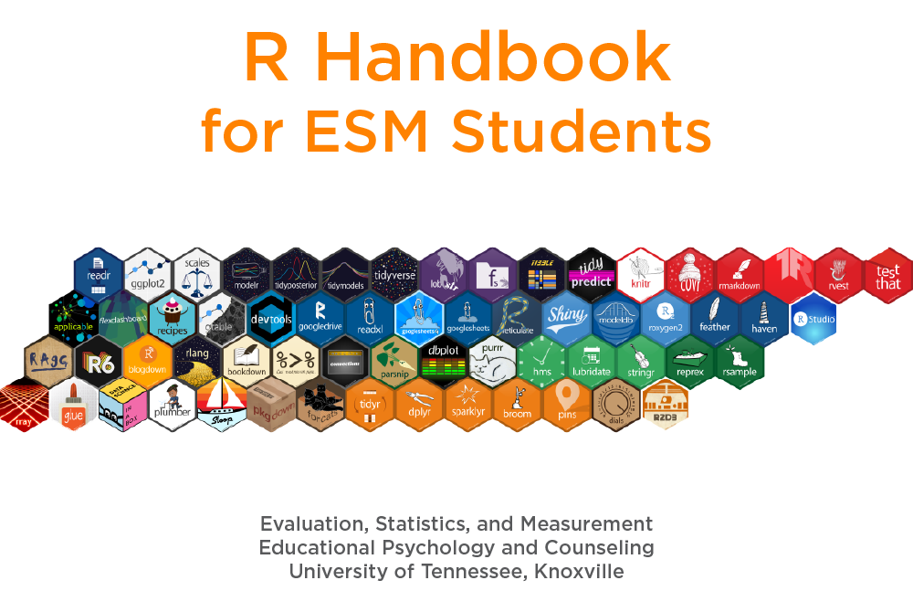

--- 
title: |
  

author: ""
date: "Last Updated `r Sys.Date()`"
site: bookdown::bookdown_site
# output: word_document\
output: bookdown::gitbook
documentclass: book
bibliography: [book.bib]
biblio-style: apalike
link-citations: yes
github-repo: acircleda/RESMHandbook
description: "This is a handbook to help UTK Evaluation, Statistics, and Measruement students master R."
---

We embed a `css` code chunk here.

```{css, echo=FALSE}
p {
  font-family: Cambria;
}
```

# Introduction {-}

Welcome to the R Handbook for ESM Students. This handbook is a hands-on guide to help you learn R. It will take you from installation, to set up, from data cleaning to analysis, visualizing, and reporting.

<!-- Might modify this part if we include different data sets -->

This guide uses real data to help you practice with R. Specifically, it uses survey data from the [RStudio Learning R Survey](https://github.com/rstudio/learning-r-survey).

## What is R? {-}

**R** is a free, open-source programming language for statistics and data visualization. It is used in a variety of fields (e.g. science, business, education) and is considiered an in-demand skill to learn ([Muenchen, 2020](https://web.archive.org/web/20200416222014/https://r4stats.com/articles/popularity/)). As of June, 2020, R is also among the [top-10 most popular programming languages](https://www.tiobe.com/tiobe-index/).

R is useful not only because it is popular, but because it facilitates a reproducible workflow where one can easily reproduce cleaning and analyses operations with minimal effort. Furthermore, because it is open-source, it allows users contribute to and expand its base functions, giving it the power to do things other statistical software packages cannot.

## Key Terms {-}

Below are some key terms you should be familiar with before getting started with R. Links will lead you to more information and examples contained in this handbook.

<!-- https://link.springer.com/content/pdf/bbm%3A978-1-4419-1318-0%2F1.pdf -->

```{r echo=FALSE, message=FALSE, warning=FALSE, results='asis'}
library(gsheet)
library(tidyverse)
gsheet2tbl("https://docs.google.com/spreadsheets/d/1Q7PlUFYrbZ3QeZsPbDvOwjO3blH7QB6AnMMmAt4d7uc/edit#gid=1727694754") %>%
  knitr::kable()
  
```


## Common Symbols {-}

```{r echo=FALSE, message=FALSE, warning=FALSE}
gsheet2tbl("https://docs.google.com/spreadsheets/d/1Q7PlUFYrbZ3QeZsPbDvOwjO3blH7QB6AnMMmAt4d7uc/edit#gid=119314878") %>%
  knitr::kable()
```
 
  
